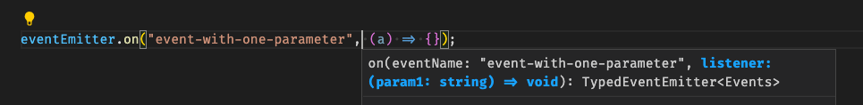

# minimal-typed-event-emitter

A minimalistic package that allows you to define typed event names and callbacks on `EventEmitter`.

Documentation of original EventEmitter is preserved.  
Listener parameter names are supported.  
All member methods of `EventEmitter` are supported.




## Usage

### Installation

```shell
npm install minimal-typed-event-emitter --save-dev
# or:
yarn add minimal-typed-event-emitter --dev
```

### When you want an EventEmitter instance:

```typescript
import { TypedEventEmitter } from "minimal-typed-event-emitter";

type Events = {
  "event-with-no-parameters": [];
  "event-with-one-parameter": [param1: string]; // You can use any parameter name
  "event-with-two-parameters-one-optional": [param1: number, param2?: { inner: string }];
};

const eventEmitter = new TypedEventEmitter<Events>();
// Also works: const eventEmitter = new EventEmitter() as TypedEventEmitter<Events>;

eventEmitter.on("event-with-no-parameters", () => {});
eventEmitter.on("event-with-one-parameter", (a) => {});
eventEmitter.on("event-with-two-parameters-one-optional", (a, b) => {});

eventEmitter.emit("event-with-two-parameters-one-optional", 1);
eventEmitter.emit("event-with-two-parameters-one-optional", 1, 2); // Error: Argument of type 'number' is not assignable to parameter of type '{ inner: string; }'.ts(2345)
```

### When you want to extend EventEmitter:

```typescript
import { TypedEventEmitter } from "minimal-typed-event-emitter";

type Events = {
  "event-with-no-parameters": [];
  "event-with-one-parameter": [param1: string];
  "event-with-two-parameters-one-optional": [param1: number, param2?: { inner: string }];
};

class MyEventEmitter extends TypedEventEmitter<Events> {
  // ...
}

const myEventEmitter = new MyEventEmitter();

myEventEmitter.on("event-with-no-parameters", () => {});
myEventEmitter.on("event-with-one-parameter", (a) => {});
myEventEmitter.on("event-with-two-parameters-one-optional", (a, b) => {});

myEventEmitter.emit("event-with-two-parameters-one-optional", 1);
myEventEmitter.emit("event-with-two-parameters-one-optional", 1, 2); // Error: Argument of type 'number' is not assignable to parameter of type '{ inner: string; }'.ts(2345)
```
